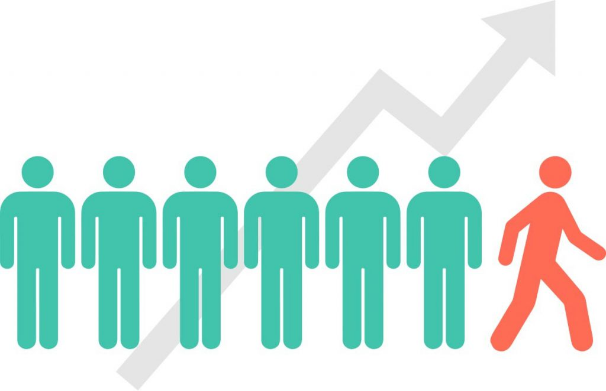
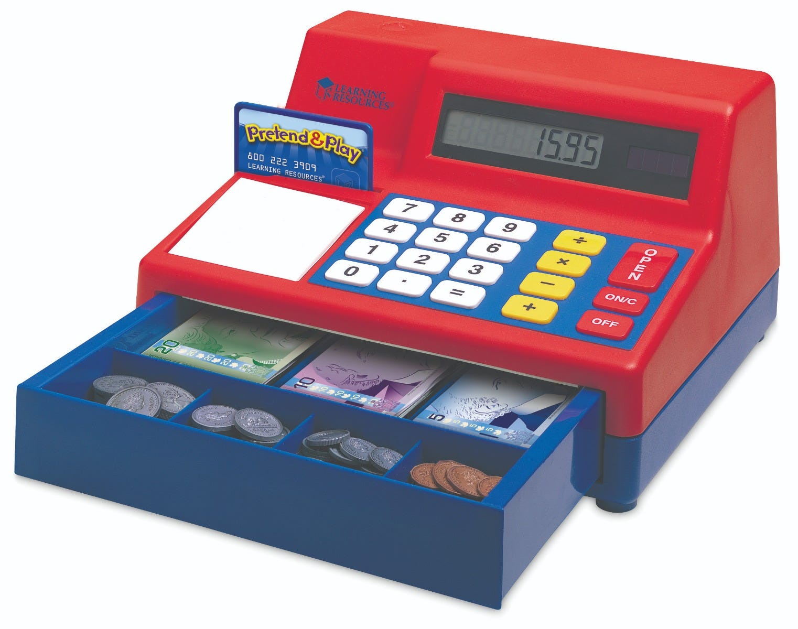

<h2 align="center">Data Science Projects Portfolio</h2>

<h4 align="center">
<a href="https://github.com/ajitkolekar/Data-Science-Projects/tree/main/Targeting%20Customers%20for%20Marketing%20Campaign">1. Targeting Customers for Marketing Campaign</a></h4>

 

<h4 align="center">
<a href="https://github.com/ajitkolekar/Data-Science-Projects/tree/main/Determine%20chance%20of%20getting%20admitted%20to%20a%20specific%20university">2. Determine chance of getting admitted to a specific university</a></h4>

 

<h4 align="center">
<a href="https://github.com/ajitkolekar/Data-Science-Projects/tree/main/Combating%20Fraudulent%20Transactions">3. Combating Fraudulent Transactions - Research Paper</a></h4>

 

<h4 align="center">
<a href="https://github.com/ajitkolekar/Data-Science-Projects/tree/main/Heart%20Failure%20Prediction">4. Heart Failure Prediction</a></h4>

 

<h4 align="center">
<a href="https://github.com/ajitkolekar/Data-Science-Projects/tree/main/Stock%20Price%20Prediction">5. Stock Price Prediction</a></h4>

 

<h4 align="center">
<a href="https://github.com/ajitkolekar/Data-Science-Projects/tree/main/Telecom%20Customer%20Churn%20Prediction">6. Telecom Customer Churn Prediction</a></h4>

 

<h4 align="center">
<a href="https://github.com/ajitkolekar/Data-Science-Projects/tree/main/Cash%20Register%20Program">7. Cash Register Program in Python</a></h4>

 

<h4 align="center">
<a href="https://github.com/ajitkolekar/Data-Science-Projects/tree/main/Airline%20Safety%20-%20Data%20Visualization">8. Airline Safety - Data Visualization</a></h4>

 

<h4 align="center">
<a href="https://github.com/ajitkolekar/Data-Science-Projects/tree/main/Pollution%20-%20Data%20Preparation">9. Pollution - Data Preparation</a></h4>

 

Reference: All images were downloaded from Google

    <!-- Portfolio Item 1-->
    

        
        

            <h4><b>Marketing Campaign</b></h4> 
        

    

